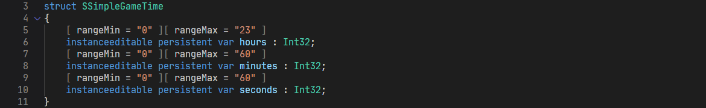
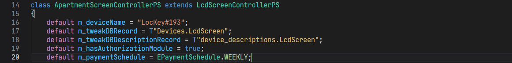
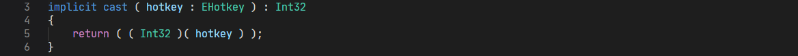
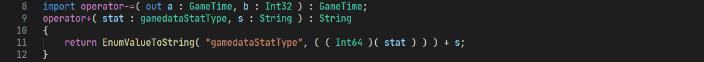
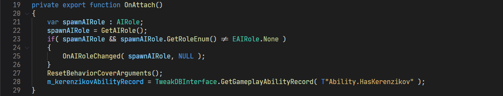
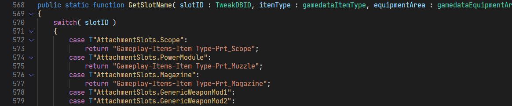
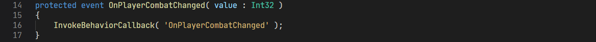

# REDmodScript

VSCode syntax highlighting for [REDmod](https://www.cyberpunk.net/en/modding-support) `'.script'` files.

Hastily cobbled together from scratch; partially with ❤️. 

Makes browsing CDPR's source scripts *subjectively* more pleasant. Beyond that, use `redscript`.

> ⚠️ This project is **solely intended** to be used with the related `*.script` files from CDPR's [REDmod](https://www.cyberpunk.net/en/modding-support) modding tool! For syntax highlighting pertaining to the community-created [redscript](https://github.com/jac3km4/redscript) scripting language (`*.reds` files), please refer to [Redscript Syntax Highlighting](https://marketplace.visualstudio.com/items?itemName=jackhumbert.redscript-syntax-highlighting) on the Marketplace.

## Notable Coverage

Support for:
- **attributes** for `class/struct` members
  

- **runtime defaults** for `class/struct` members
  

- **type-**`cast overloads`
  

- **operator** `overloads`
  

- `NULL`*-type*; `m_*` member variable and *known-*`enum` member distinctions
  

- distinction between `CName`, `TweakDBID`, `ResRef` literals and generic `String`-literals
  
  *(`CName` literal is single-quoted):*
  

## Installation

Install directly from VSCode's Extension Manager or via the [Marketplace](https://marketplace.visualstudio.com/items?itemName=alternaut-dev.redmodscript-lang) page.

## Known Issues

**None.** However, it should be noted that this extension was only tested against VSCode's `Dark+ (default theme)`.

